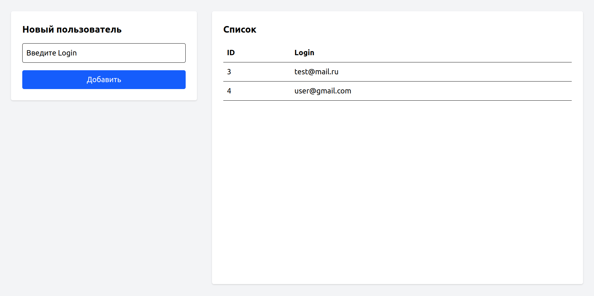

# Kafka

## Docker

```bash
# поднять окружение
$ docker compose up -d

# пересоздать контейнеры с очисткой томов
# docker compose down -v
# docker compose up -d
```

## Producer/Consumer/UI

```bash
# перейти в папку producer/consumer/ui
$ cd producer
$ cd consumer
$ cd ui

# установить зависимости
$ npm i

# запустить приложение
$ npm run dev
```

